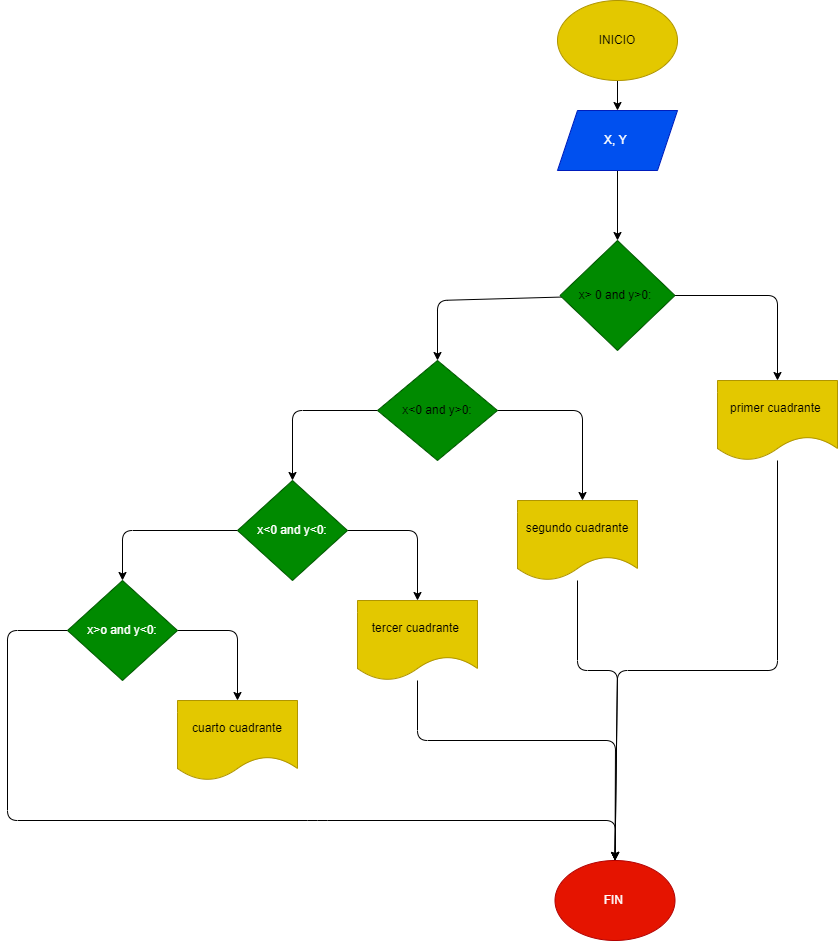

# Programa que lea las coordenadas cartesianas (x, y) de un punto 

coordenadas cartecianas que lea un punto en el plano y calcule el cuadrante al cual pertenece el punto. Si el punto está en el origen o sobre un eje también debe indicarlo.

# Analisis 
El problema platea que se debe realizar un programa que determine en que cuadrante can las coordenadas ingresadas 

* Sabiendo que el origen es (0,0)
* Eje X 
* Eje Y

En el primer cuadrante la cordenadas deben coincidor con X>0 , Y>0 
En el segundo cuadrante la cordenadas deben coincidor con X<0, Y>0
En el tercer cuadrante la cordenadas deben coincidor con X<0 , Y<0 
En el cuarto cuadrante la cordenadas deben coincidor con X>0 , Y<0 

## Diagrama de flujo 
