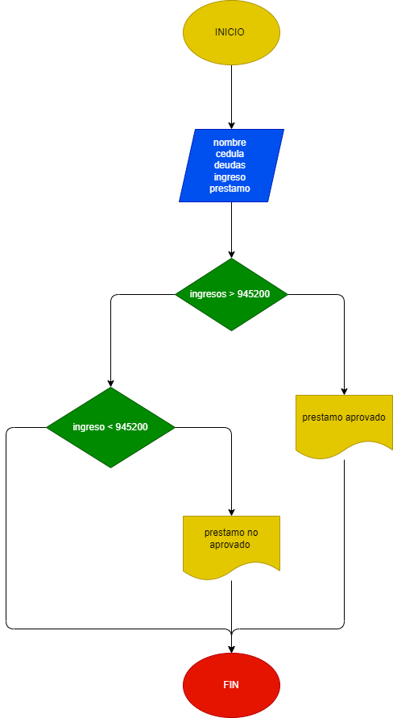

# PRESTAMO BANCARIO 
Programa que permita realizar un préstamo bancario teniendo en cuenta que el préstamo será otorgado solamente a personas con ingresos
superiores a $945200 y que no posea ninguna otra deuda.

# Analisis 
El programa debe realizar un prestamo teniendo en cuenta que la persona debe ganar un monto superios a lo estipulado y que no posea deudadas si gana el monto estipulado se procedera en realizar el prestamo 

## Diagrama de flujo 
